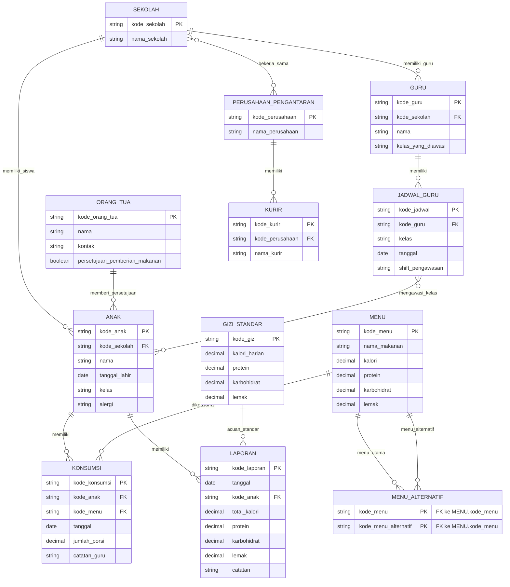

# ERD MBG - Studi Kasus 2

Dokumen ini disusun berdasarkan `Studi Kasus 2-MBG.pdf`.

Prinsip penyusunan:

- Hanya memakai entitas, atribut, PK, dan FK yang disebut atau dapat langsung diturunkan dari daftar data pada studi kasus.
- Tidak menambah atribut baru di luar studi kasus.
- Bagian yang disebut pada narasi tetapi belum memiliki data/atribut eksplisit dicatat sebagai gap requirement, bukan dimasukkan ke ERD inti.
- Tipe data pada blok Mermaid hanya penanda teknis agar diagram bisa dibaca, bukan tambahan requirement dari studi kasus.
- Jika suatu relasi tidak memiliki FK eksplisit pada daftar data, relasi tersebut tidak dipaksakan di ERD inti.
- Revisi tambahan: `SEKOLAH`, `PERUSAHAAN_PENGANTARAN`, dan `KURIR` ditambahkan karena narasi studi kasus menyebut beberapa TK/PAUD, kerja sama dengan perusahaan pengantaran makanan, dan kurir pengantar.

## Entitas, PK, dan FK

### SEKOLAH

PK:

- `kode_sekolah`

FK:

- Tidak ada

Atribut:

- `nama_sekolah`

Catatan:

- Entitas ini ditambahkan karena studi kasus menyebut program berjalan pada beberapa TK/PAUD.
- Relasi paling sederhana adalah satu sekolah memiliki banyak anak.

### ORANG_TUA

PK:

- `kode_orang_tua`

FK:

- Tidak ada FK eksplisit pada daftar data.

Atribut:

- `nama`
- `kontak`
- `persetujuan_pemberian_makanan`

### ANAK

PK:

- `kode_anak`

FK:

- `kode_sekolah` -> SEKOLAH.`kode_sekolah`

Atribut:

- `kode_sekolah`
- `nama`
- `tanggal_lahir`
- `kelas`
- `alergi`

Catatan:

- Narasi studi kasus menyebut orang tua/wali memilih menu untuk anak.
- Namun, daftar data anak tidak mencantumkan `kode_orang_tua`.
- Karena itu relasi ORANG_TUA ke ANAK tidak dimasukkan ke ERD inti agar tidak menambah atribut sendiri.

### GURU

PK:

- `kode_guru`

FK:

- `kode_sekolah` -> SEKOLAH.`kode_sekolah`

Atribut:

- `kode_sekolah`
- `nama`
- `kelas_yang_diawasi`

### MENU

PK:

- `kode_menu`

FK:

- Tidak ada

Atribut:

- `nama_makanan`
- `kalori`
- `protein`
- `karbohidrat`
- `lemak`

Catatan:

- Studi kasus menulis "nilai gizi per porsi".
- Pada paragraf sebelumnya, nilai gizi dijelaskan sebagai kalori, protein, karbohidrat, dan lemak.
- Karena itu nilai gizi per porsi dipecah menjadi empat atribut tersebut.

### KONSUMSI

PK:

- `kode_konsumsi`

FK:

- `kode_anak` -> ANAK.`kode_anak`
- `kode_menu` -> MENU.`kode_menu`

Atribut:

- `tanggal`
- `jumlah_porsi`
- `catatan_guru`

### GIZI_STANDAR

PK:

- `kode_gizi`

FK:

- Tidak ada FK eksplisit pada daftar data.

Atribut:

- `kalori_harian`
- `protein`
- `karbohidrat`
- `lemak`

Catatan:

- Tabel ini dapat dipakai sebagai acuan perbandingan konsumsi gizi.
- Studi kasus tidak menjelaskan apakah standar gizi berbeda berdasarkan umur, kelas, atau anak tertentu.
- Karena itu tidak dibuat FK tambahan ke ANAK, KELAS, atau entitas lain.

### MENU_ALTERNATIF

PK:

- `kode_menu`
- `kode_menu_alternatif`

Composite Primary Key:

- (`kode_menu`, `kode_menu_alternatif`)

FK:

- `kode_menu` -> MENU.`kode_menu`
- `kode_menu_alternatif` -> MENU.`kode_menu`

Catatan:

- Tabel ini menjadi bridge table untuk relasi menu utama dan menu alternatif.
- Kedua kolom mengarah ke tabel MENU karena menu alternatif tetap merupakan data menu.

### JADWAL_GURU

PK:

- `kode_jadwal`

FK:

- `kode_guru` -> GURU.`kode_guru`

Atribut:

- `kelas`
- `tanggal`
- `shift_pengawasan`

### LAPORAN

PK:

- `kode_laporan`

FK:

- `kode_anak` -> ANAK.`kode_anak`

Atribut:

- `tanggal`
- `total_kalori`
- `protein`
- `karbohidrat`
- `lemak`
- `catatan`

### PERUSAHAAN_PENGANTARAN

PK:

- `kode_perusahaan`

FK:

- Tidak ada

Atribut:

- `nama_perusahaan`

Catatan:

- Entitas ini ditambahkan karena studi kasus menyebut sekolah bekerja sama dengan perusahaan pengantaran makanan.
- Satu sekolah dapat bekerja sama dengan banyak perusahaan pengantaran, dan satu perusahaan dapat bekerja sama dengan banyak sekolah.

### KURIR

PK:

- `kode_kurir`

FK:

- `kode_perusahaan` -> PERUSAHAAN_PENGANTARAN.`kode_perusahaan`

Atribut:

- `kode_perusahaan`
- `nama_kurir`

Catatan:

- Entitas ini ditambahkan karena studi kasus menyebut diperlukan kurir untuk mengantar makanan ke rumah siswa.
- Kurir direlasikan ke perusahaan pengantaran, bukan langsung ke sekolah.

## ERD Mermaid

Catatan membaca diagram:

- Entitas dan atribut tetap hanya memakai data yang disebut pada studi kasus.
- Relasi digambar berdasarkan FK yang tersedia dan narasi yang eksplisit pada studi kasus.
- Diagram ini tidak menambahkan atribut baru seperti `kode_orang_tua` pada ANAK atau tabel baru seperti KELAS/PEMILIHAN_MENU.
- Tambahan `SEKOLAH`, `PERUSAHAAN_PENGANTARAN`, dan `KURIR` berasal dari narasi pengantaran pada studi kasus.



## Relasi yang Terbentuk

Relasi yang digambar pada ERD:

```text
SEKOLAH (1) ------ (N) ANAK

SEKOLAH (1) ------ (N) GURU

ORANG_TUA (1) ------ (N) ANAK

ANAK (1) ------ (N) KONSUMSI

MENU (1) ------ (N) KONSUMSI

GURU (1) ------ (N) JADWAL_GURU

JADWAL_GURU (M) ------ (N) ANAK
        berdasarkan kelas yang diawasi

ANAK (1) ------ (N) LAPORAN

GIZI_STANDAR (1) ------ (N) LAPORAN
        sebagai acuan standar gizi

MENU (M) ------ (N) MENU
        melalui MENU_ALTERNATIF

SEKOLAH (M) ------ (N) PERUSAHAAN_PENGANTARAN
        sebagai kerja sama pengantaran makanan

PERUSAHAAN_PENGANTARAN (1) ------ (N) KURIR
```

Dasar relasi:

| Relasi | Dasar dari Studi Kasus | Catatan |
|---|---|---|
| SEKOLAH - ANAK | Program memantau anak-anak di beberapa TK/PAUD di satu kota. | Kaki bebek di sisi ANAK: satu sekolah memiliki banyak anak, satu anak berada pada satu sekolah. |
| SEKOLAH - GURU | Guru mengawasi pemberian makanan di TK/PAUD tempat program berjalan. | Kaki bebek di sisi GURU: satu sekolah memiliki banyak guru, satu guru berada pada satu sekolah. |
| ORANG_TUA - ANAK | Orang tua memberikan persetujuan dan menuliskan alergi anak; orang tua/wali memilih menu untuk siswa. | Relasi digambar di ERD konseptual, tetapi atribut `kode_orang_tua` tidak ditambahkan ke ANAK karena tidak ada pada daftar data anak. |
| ANAK - KONSUMSI | Data konsumsi memiliki `kode_anak`. | FK eksplisit. |
| MENU - KONSUMSI | Data konsumsi memiliki `kode_menu`. | FK eksplisit. |
| GURU - JADWAL_GURU | Jadwal guru memiliki `kode_guru`. | FK eksplisit. |
| JADWAL_GURU - ANAK | Jadwal guru menyimpan `kelas`, dan anak juga memiliki atribut `kelas`. | Relasi konseptual berdasarkan kelas; tidak dibuat tabel KELAS karena tidak ada pada daftar data. |
| ANAK - LAPORAN | Data laporan memiliki `kode_anak`. | FK eksplisit. |
| GIZI_STANDAR - LAPORAN | Sistem membandingkan konsumsi/total gizi anak dengan standar gizi. | Relasi konseptual sebagai acuan standar; tidak menambah FK karena daftar data tidak menyebut FK. |
| MENU - MENU_ALTERNATIF | Data menu alternatif berisi `kode_menu` dan `kode_menu_alternatif`. | FK eksplisit ke MENU. |
| SEKOLAH - PERUSAHAAN_PENGANTARAN | Sekolah bekerja sama dengan perusahaan pengantaran makanan. | Kaki bebek di kedua sisi: satu sekolah bisa bekerja sama dengan banyak perusahaan, satu perusahaan bisa bekerja sama dengan banyak sekolah. |
| PERUSAHAAN_PENGANTARAN - KURIR | Pengantaran dilakukan oleh kurir dari perusahaan pengantaran. | Kaki bebek di sisi KURIR: satu perusahaan memiliki banyak kurir, satu kurir berada pada satu perusahaan. |

## Pemetaan ERD ke Tabel Relasional

Pemetaan mengikuti konsep pada slide pemetaan ER/EER ke skema relasional:

- Regular entity type dipetakan menjadi tabel.
- Relasi 1:N dipetakan dengan memasukkan PK dari sisi 1 sebagai FK pada sisi N.
- Relasi M:N dipetakan menjadi tabel baru yang berisi PK dari kedua entitas yang berelasi.
- Weak entity, multivalued attribute, dan N-ary relationship tidak digunakan karena tidak ada struktur eksplisitnya pada daftar data studi kasus.

### 1. Pemetaan Regular Entity Type

Setiap entitas/data utama pada studi kasus dipetakan menjadi tabel relasional.

| No | Entitas ERD | Hasil Pemetaan Tabel |
|---:|---|---|
| 1 | SEKOLAH | SEKOLAH(`kode_sekolah`, `nama_sekolah`) |
| 2 | ORANG_TUA | ORANG_TUA(`kode_orang_tua`, `nama`, `kontak`, `persetujuan_pemberian_makanan`) |
| 3 | ANAK | ANAK(`kode_anak`, `kode_sekolah`, `nama`, `tanggal_lahir`, `kelas`, `alergi`) |
| 4 | GURU | GURU(`kode_guru`, `kode_sekolah`, `nama`, `kelas_yang_diawasi`) |
| 5 | MENU | MENU(`kode_menu`, `nama_makanan`, `kalori`, `protein`, `karbohidrat`, `lemak`) |
| 6 | KONSUMSI | KONSUMSI(`kode_konsumsi`, `kode_anak`, `kode_menu`, `tanggal`, `jumlah_porsi`, `catatan_guru`) |
| 7 | GIZI_STANDAR | GIZI_STANDAR(`kode_gizi`, `kalori_harian`, `protein`, `karbohidrat`, `lemak`) |
| 8 | JADWAL_GURU | JADWAL_GURU(`kode_jadwal`, `kode_guru`, `kelas`, `tanggal`, `shift_pengawasan`) |
| 9 | LAPORAN | LAPORAN(`kode_laporan`, `tanggal`, `kode_anak`, `total_kalori`, `protein`, `karbohidrat`, `lemak`, `catatan`) |
| 10 | PERUSAHAAN_PENGANTARAN | PERUSAHAAN_PENGANTARAN(`kode_perusahaan`, `nama_perusahaan`) |
| 11 | KURIR | KURIR(`kode_kurir`, `kode_perusahaan`, `nama_kurir`) |

Catatan:

- KONSUMSI tetap ditampilkan karena studi kasus menyebutnya sebagai data tersendiri dan memberi `kode_konsumsi`.
- Secara relasional, KONSUMSI juga berfungsi sebagai tabel penghubung antara ANAK dan MENU.
- MENU_ALTERNATIF tidak dimasukkan pada bagian regular entity karena fungsinya sebagai tabel penghubung menu utama dan menu alternatif.
- Semua atribut pada tabel diambil dari daftar data studi kasus.

### 2. Pemetaan Relasi Binary 1:N

Pada relasi 1:N yang memiliki atribut FK eksplisit, PK dari entitas sisi 1 diletakkan sebagai FK pada entitas sisi N.

| No | Relasi ERD | Aturan Pemetaan | Hasil FK |
|---:|---|---|---|
| 1 | SEKOLAH (1) ke ANAK (N) | PK SEKOLAH masuk ke ANAK | ANAK.`kode_sekolah` -> SEKOLAH.`kode_sekolah` |
| 2 | SEKOLAH (1) ke GURU (N) | PK SEKOLAH masuk ke GURU | GURU.`kode_sekolah` -> SEKOLAH.`kode_sekolah` |
| 3 | ANAK (1) ke KONSUMSI (N) | PK ANAK masuk ke KONSUMSI | KONSUMSI.`kode_anak` -> ANAK.`kode_anak` |
| 4 | MENU (1) ke KONSUMSI (N) | PK MENU masuk ke KONSUMSI | KONSUMSI.`kode_menu` -> MENU.`kode_menu` |
| 5 | GURU (1) ke JADWAL_GURU (N) | PK GURU masuk ke JADWAL_GURU | JADWAL_GURU.`kode_guru` -> GURU.`kode_guru` |
| 6 | ANAK (1) ke LAPORAN (N) | PK ANAK masuk ke LAPORAN | LAPORAN.`kode_anak` -> ANAK.`kode_anak` |
| 7 | PERUSAHAAN_PENGANTARAN (1) ke KURIR (N) | PK PERUSAHAAN_PENGANTARAN masuk ke KURIR | KURIR.`kode_perusahaan` -> PERUSAHAAN_PENGANTARAN.`kode_perusahaan` |

### 3. Pemetaan Relasi Binary M:N

Pada relasi M:N, dibuat tabel penghubung yang berisi PK dari kedua sisi relasi. Jika studi kasus sudah menyediakan kode khusus untuk tabel penghubung, kode tersebut dipakai sebagai PK sesuai data yang diberikan.

| Relasi ERD | Hasil Pemetaan | Primary Key | Foreign Key |
|---|---|---|---|
| ANAK (M) ke MENU (N) | KONSUMSI(`kode_konsumsi`, `kode_anak`, `kode_menu`, `tanggal`, `jumlah_porsi`, `catatan_guru`) | `kode_konsumsi` | `kode_anak` -> ANAK.`kode_anak`, `kode_menu` -> MENU.`kode_menu` |
| MENU (M) ke MENU (N) | MENU_ALTERNATIF(`kode_menu`, `kode_menu_alternatif`) | (`kode_menu`, `kode_menu_alternatif`) | `kode_menu` -> MENU.`kode_menu`, `kode_menu_alternatif` -> MENU.`kode_menu` |
| SEKOLAH (M) ke PERUSAHAAN_PENGANTARAN (N) | Relasi konseptual `bekerja_sama` | - | Jika dipetakan ke SQL fisik, perlu tabel bridge `KERJA_SAMA_PENGANTARAN(kode_sekolah, kode_perusahaan)`. |

### 4. Pemetaan yang Tidak Dilakukan

Bagian ini tidak dipetakan menjadi tabel/FK inti karena daftar data studi kasus belum menyediakan atribut atau tabel penghubungnya.

| Narasi Studi Kasus | Alasan Tidak Dipetakan |
|---|---|
| ORANG_TUA berelasi dengan ANAK | Tidak ada `kode_orang_tua` pada ANAK dan tidak ada tabel penghubung ORANG_TUA_ANAK. |
| Orang tua memilih menu untuk anak | Tidak ada tabel pemilihan menu. |
| Sistem mengetahui siapa yang memilihkan menu | Tidak ada atribut orang tua pemilih dan tidak ada tabel transaksi pemilihan menu. |
| JADWAL_GURU berelasi dengan ANAK berdasarkan kelas | Tidak ada tabel KELAS; kelas hanya atribut pada ANAK, GURU, dan JADWAL_GURU. |
| GIZI_STANDAR dipakai sebagai pembanding LAPORAN | Tidak ada FK dari GIZI_STANDAR ke ANAK, KELAS, KONSUMSI, atau LAPORAN. |
| Detail transaksi pengantaran makanan ke rumah siswa | Entitas `KURIR` dan `PERUSAHAAN_PENGANTARAN` sudah ditambahkan, tetapi transaksi pengantaran per anak belum dibuat agar tambahan tetap dibatasi. |

## Tabel Relasional

Tabel relasional berikut dibuat dari entitas dan FK yang tersedia pada daftar data studi kasus.

| No | Relasi | Primary Key | Foreign Key | Atribut Non-Key |
|---:|---|---|---|---|
| 1 | SEKOLAH(`kode_sekolah`, `nama_sekolah`) | `kode_sekolah` | - | `nama_sekolah` |
| 2 | ORANG_TUA(`kode_orang_tua`, `nama`, `kontak`, `persetujuan_pemberian_makanan`) | `kode_orang_tua` | - | `nama`, `kontak`, `persetujuan_pemberian_makanan` |
| 3 | ANAK(`kode_anak`, `kode_sekolah`, `nama`, `tanggal_lahir`, `kelas`, `alergi`) | `kode_anak` | `kode_sekolah` -> SEKOLAH.`kode_sekolah` | `nama`, `tanggal_lahir`, `kelas`, `alergi` |
| 4 | GURU(`kode_guru`, `kode_sekolah`, `nama`, `kelas_yang_diawasi`) | `kode_guru` | `kode_sekolah` -> SEKOLAH.`kode_sekolah` | `nama`, `kelas_yang_diawasi` |
| 5 | MENU(`kode_menu`, `nama_makanan`, `kalori`, `protein`, `karbohidrat`, `lemak`) | `kode_menu` | - | `nama_makanan`, `kalori`, `protein`, `karbohidrat`, `lemak` |
| 6 | KONSUMSI(`kode_konsumsi`, `kode_anak`, `kode_menu`, `tanggal`, `jumlah_porsi`, `catatan_guru`) | `kode_konsumsi` | `kode_anak` -> ANAK.`kode_anak`, `kode_menu` -> MENU.`kode_menu` | `tanggal`, `jumlah_porsi`, `catatan_guru` |
| 7 | GIZI_STANDAR(`kode_gizi`, `kalori_harian`, `protein`, `karbohidrat`, `lemak`) | `kode_gizi` | - | `kalori_harian`, `protein`, `karbohidrat`, `lemak` |
| 8 | MENU_ALTERNATIF(`kode_menu`, `kode_menu_alternatif`) | (`kode_menu`, `kode_menu_alternatif`) | `kode_menu` -> MENU.`kode_menu`, `kode_menu_alternatif` -> MENU.`kode_menu` | - |
| 9 | JADWAL_GURU(`kode_jadwal`, `kode_guru`, `kelas`, `tanggal`, `shift_pengawasan`) | `kode_jadwal` | `kode_guru` -> GURU.`kode_guru` | `kelas`, `tanggal`, `shift_pengawasan` |
| 10 | LAPORAN(`kode_laporan`, `tanggal`, `kode_anak`, `total_kalori`, `protein`, `karbohidrat`, `lemak`, `catatan`) | `kode_laporan` | `kode_anak` -> ANAK.`kode_anak` | `tanggal`, `total_kalori`, `protein`, `karbohidrat`, `lemak`, `catatan` |
| 11 | PERUSAHAAN_PENGANTARAN(`kode_perusahaan`, `nama_perusahaan`) | `kode_perusahaan` | - | `nama_perusahaan` |
| 12 | KURIR(`kode_kurir`, `kode_perusahaan`, `nama_kurir`) | `kode_kurir` | `kode_perusahaan` -> PERUSAHAAN_PENGANTARAN.`kode_perusahaan` | `nama_kurir` |

Catatan:

- ANAK tidak diberi `kode_orang_tua` karena atribut tersebut tidak ada pada daftar data anak di studi kasus.
- ORANG_TUA tetap dibuat sebagai relasi mandiri karena data orang tua disebut eksplisit.
- GIZI_STANDAR tetap dibuat sebagai relasi mandiri karena data standar gizi disebut eksplisit, tetapi tidak ada FK yang menghubungkannya ke tabel lain.

## Fungsi Dependensi (FD)

Mengacu pada materi Chapter 14, functional dependency digunakan untuk menjelaskan bahwa satu atribut atau sekumpulan atribut menentukan nilai atribut lain secara unik. FD berikut diturunkan dari PK dan makna atribut pada studi kasus.

| No | Relasi | Functional Dependency | Keterangan |
|---:|---|---|---|
| 1 | SEKOLAH | `kode_sekolah` -> `nama_sekolah` | Satu kode sekolah menentukan data sekolah. |
| 2 | ORANG_TUA | `kode_orang_tua` -> `nama`, `kontak`, `persetujuan_pemberian_makanan` | Satu kode orang tua menentukan data orang tua. |
| 3 | ANAK | `kode_anak` -> `kode_sekolah`, `nama`, `tanggal_lahir`, `kelas`, `alergi` | Satu kode anak menentukan data anak dan sekolahnya. |
| 4 | GURU | `kode_guru` -> `kode_sekolah`, `nama`, `kelas_yang_diawasi` | Satu kode guru menentukan data guru dan sekolahnya. |
| 5 | MENU | `kode_menu` -> `nama_makanan`, `kalori`, `protein`, `karbohidrat`, `lemak` | Satu kode menu menentukan nama makanan dan nilai gizi per porsi. |
| 6 | KONSUMSI | `kode_konsumsi` -> `kode_anak`, `kode_menu`, `tanggal`, `jumlah_porsi`, `catatan_guru` | Satu kode konsumsi menentukan data konsumsi harian. |
| 7 | GIZI_STANDAR | `kode_gizi` -> `kalori_harian`, `protein`, `karbohidrat`, `lemak` | Satu kode gizi menentukan standar gizi. |
| 8 | MENU_ALTERNATIF | (`kode_menu`, `kode_menu_alternatif`) -> seluruh atribut relasi | Composite key menentukan satu pasangan menu utama dan menu alternatif. |
| 9 | JADWAL_GURU | `kode_jadwal` -> `kode_guru`, `kelas`, `tanggal`, `shift_pengawasan` | Satu kode jadwal menentukan guru, kelas, tanggal, dan shift pengawasan. |
| 10 | LAPORAN | `kode_laporan` -> `tanggal`, `kode_anak`, `total_kalori`, `protein`, `karbohidrat`, `lemak`, `catatan` | Satu kode laporan menentukan isi laporan gizi anak. |
| 11 | PERUSAHAAN_PENGANTARAN | `kode_perusahaan` -> `nama_perusahaan` | Satu kode perusahaan menentukan data perusahaan pengantaran. |
| 12 | KURIR | `kode_kurir` -> `kode_perusahaan`, `nama_kurir` | Satu kode kurir menentukan data kurir dan perusahaan tempat kurir berada. |

FD yang tidak diasumsikan:

- `kode_menu` -> `kode_menu_alternatif` tidak diasumsikan, karena satu menu dapat memiliki lebih dari satu menu alternatif.
- `kode_menu_alternatif` -> `kode_menu` tidak diasumsikan, karena satu menu alternatif dapat dipakai untuk lebih dari satu menu utama.
- `kode_anak` -> `kode_orang_tua` tidak diasumsikan, karena FK tersebut tidak ada pada daftar data eksplisit.
- (`kode_anak`, `tanggal`) -> `kode_laporan` tidak diasumsikan, karena studi kasus tidak menjelaskan aturan satu laporan per anak per tanggal.

## Normalisasi

Normalisasi dilakukan berdasarkan konsep Chapter 14:

- 1NF: atribut harus bernilai atomik, tidak berulang, dan tidak berbentuk nested relation.
- 2NF: setiap atribut non-prime harus bergantung penuh pada primary key.
- 3NF: relasi sudah 2NF dan tidak ada atribut non-prime yang bergantung secara transitif pada primary key.

### Pemeriksaan 1NF

| Relasi | Status 1NF | Alasan |
|---|---|---|
| SEKOLAH | Memenuhi 1NF | Semua atribut bernilai tunggal. |
| ORANG_TUA | Memenuhi 1NF | Semua atribut bernilai tunggal sesuai daftar data. |
| ANAK | Memenuhi 1NF | `alergi` diperlakukan sebagai satu atribut atomik sesuai daftar data. |
| GURU | Memenuhi 1NF | Semua atribut bernilai tunggal sesuai daftar data. |
| MENU | Memenuhi 1NF | Nilai gizi dipisah menjadi `kalori`, `protein`, `karbohidrat`, dan `lemak`. |
| KONSUMSI | Memenuhi 1NF | Data konsumsi disimpan per baris konsumsi. |
| GIZI_STANDAR | Memenuhi 1NF | Standar gizi disimpan sebagai atribut atomik. |
| MENU_ALTERNATIF | Memenuhi 1NF | Setiap baris hanya menyimpan satu pasangan menu dan menu alternatif. |
| JADWAL_GURU | Memenuhi 1NF | Jadwal disimpan per baris jadwal. |
| LAPORAN | Memenuhi 1NF | Total gizi dan catatan laporan disimpan sebagai atribut atomik. |
| PERUSAHAAN_PENGANTARAN | Memenuhi 1NF | Semua atribut bernilai tunggal. |
| KURIR | Memenuhi 1NF | Satu baris menyimpan satu kurir dan perusahaan asalnya. |

Catatan:

- Jika `alergi` berisi banyak nilai dalam satu kolom, maka secara teori 1NF perlu tabel alergi terpisah.
- Namun, tabel alergi tidak dibuat pada ERD inti karena studi kasus hanya memberikan atribut `alergi`, bukan entitas alergi atau tabel penghubung alergi.

### Pemeriksaan 2NF

| Relasi | Status 2NF | Alasan |
|---|---|---|
| SEKOLAH | Memenuhi 2NF | PK tunggal, sehingga tidak ada partial dependency. |
| ORANG_TUA | Memenuhi 2NF | PK tunggal, sehingga tidak ada partial dependency. |
| ANAK | Memenuhi 2NF | PK tunggal, sehingga tidak ada partial dependency. |
| GURU | Memenuhi 2NF | PK tunggal, sehingga tidak ada partial dependency. |
| MENU | Memenuhi 2NF | PK tunggal, sehingga tidak ada partial dependency. |
| KONSUMSI | Memenuhi 2NF | PK tunggal, sehingga atribut non-key bergantung pada `kode_konsumsi`. |
| GIZI_STANDAR | Memenuhi 2NF | PK tunggal, sehingga tidak ada partial dependency. |
| MENU_ALTERNATIF | Memenuhi 2NF | PK komposit, tetapi tidak memiliki atribut non-key, sehingga tidak ada partial dependency. |
| JADWAL_GURU | Memenuhi 2NF | PK tunggal, sehingga tidak ada partial dependency. |
| LAPORAN | Memenuhi 2NF | PK tunggal, sehingga tidak ada partial dependency. |
| PERUSAHAAN_PENGANTARAN | Memenuhi 2NF | PK tunggal, sehingga tidak ada partial dependency. |
| KURIR | Memenuhi 2NF | PK tunggal, sehingga tidak ada partial dependency. |

### Pemeriksaan 3NF

| Relasi | Status 3NF | Alasan |
|---|---|---|
| SEKOLAH | Memenuhi 3NF | `nama_sekolah` bergantung langsung pada `kode_sekolah`. |
| ORANG_TUA | Memenuhi 3NF | Tidak ada FD eksplisit antar atribut non-key. |
| ANAK | Memenuhi 3NF | Tidak ada FD eksplisit antar atribut non-key. |
| GURU | Memenuhi 3NF | Detail sekolah tidak dicampur ke guru; guru hanya menyimpan `kode_sekolah` sebagai FK. |
| MENU | Memenuhi 3NF | Nilai gizi bergantung pada `kode_menu`, bukan pada atribut non-key lain. |
| KONSUMSI | Memenuhi 3NF | Data anak dan menu hanya direferensikan dengan FK, bukan dicampur ke tabel konsumsi. |
| GIZI_STANDAR | Memenuhi 3NF | Tidak ada FD eksplisit antar atribut non-key. |
| MENU_ALTERNATIF | Memenuhi 3NF | Tidak memiliki atribut non-key. |
| JADWAL_GURU | Memenuhi 3NF | Detail guru tidak dicampur ke jadwal; jadwal hanya menyimpan `kode_guru` sebagai FK. |
| LAPORAN | Memenuhi 3NF | Data anak tidak dicampur ke laporan; laporan hanya menyimpan `kode_anak` sebagai FK. |
| PERUSAHAAN_PENGANTARAN | Memenuhi 3NF | `nama_perusahaan` bergantung langsung pada `kode_perusahaan`. |
| KURIR | Memenuhi 3NF | Detail perusahaan tidak dicampur ke kurir; kurir hanya menyimpan `kode_perusahaan` sebagai FK. |

Kesimpulan normalisasi:

- Berdasarkan FD yang tersedia dari studi kasus, semua relasi inti memenuhi 1NF, 2NF, dan 3NF.
- MENU_ALTERNATIF memakai composite primary key dan tetap memenuhi 2NF/3NF karena tidak memiliki atribut non-key.
- LAPORAN menyimpan total gizi karena tabel LAPORAN disebut eksplisit pada studi kasus. Total tersebut dapat dihitung dari KONSUMSI dan MENU, tetapi penyimpanannya tetap sesuai requirement.
- Tidak dilakukan dekomposisi tambahan karena akan membutuhkan entitas/atribut baru yang tidak tersedia pada daftar data studi kasus.

## Kesesuaian dengan Kebutuhan Aplikasi

Kebutuhan 1:

Menampilkan anak yang konsumsi kalori/protein/karbohidrat/lemak di bawah standar dalam seminggu terakhir.

Tabel yang dipakai:

- ANAK
- KONSUMSI
- MENU
- GIZI_STANDAR

Catatan:

- Perhitungan dilakukan dari jumlah porsi dikali nilai gizi per porsi pada MENU.
- Perbandingan dilakukan ke GIZI_STANDAR.
- Karena tidak ada FK pada GIZI_STANDAR, standar dianggap sebagai data acuan umum sesuai daftar data yang tersedia.

Kebutuhan 2:

Menampilkan menu alternatif untuk anak dengan alergi tertentu.

Tabel yang dipakai:

- ANAK
- MENU
- MENU_ALTERNATIF

Catatan:

- Alergi disimpan pada ANAK.`alergi`.
- Relasi alternatif menu disimpan pada MENU_ALTERNATIF.

Kebutuhan 3:

Menghitung rata-rata konsumsi gizi tiap kelas per minggu.

Tabel yang dipakai:

- ANAK
- KONSUMSI
- MENU

Catatan:

- Kelas menggunakan ANAK.`kelas`.
- Studi kasus tidak menyediakan tabel KELAS tersendiri.

Kebutuhan 4:

Menampilkan jadwal guru beserta kelas yang diawasi.

Tabel yang dipakai:

- GURU
- JADWAL_GURU

Kebutuhan 5:

Menambahkan catatan konsumsi harian baru dan update total gizi anak.

Tabel yang dipakai:

- KONSUMSI
- MENU
- LAPORAN

Catatan:

- Catatan konsumsi harian masuk ke KONSUMSI.
- Total gizi anak dapat dihitung dari KONSUMSI dan MENU, lalu disimpan atau ditampilkan melalui LAPORAN.

Kebutuhan 6:

Menampilkan laporan mingguan untuk orang tua.

Tabel yang dipakai pada ERD inti:

- LAPORAN
- ANAK

Catatan gap:

- Studi kasus menyebut laporan untuk orang tua.
- Namun, daftar data eksplisit belum memberi FK ORANG_TUA ke ANAK.
- Jadi ERD inti belum dapat menentukan orang tua mana yang menerima laporan anak tertentu tanpa penambahan relasi.

## Gap Requirement dari Narasi Studi Kasus

Bagian berikut disebut dalam narasi PDF, tetapi belum diberi struktur data lengkap pada daftar data:

### Relasi ORANG_TUA dan ANAK

Narasi:

- Orang tua/wali memilih menu untuk anak.
- Data orang tua adalah ayah dan ibu atau wali.

Masalah pada ERD inti:

- Data ANAK tidak memiliki `kode_orang_tua`.
- Tidak ada tabel penghubung ORANG_TUA_ANAK.

Jawaban aman saat sidang:

> Berdasarkan daftar data yang diberikan pada studi kasus, relasi ORANG_TUA dan ANAK belum dijelaskan secara eksplisit melalui kolom FK. Karena itu ERD inti dibuat berdasarkan data yang tersedia. Jika sistem dikembangkan untuk memenuhi narasi penuh, relasi ORANG_TUA dan ANAK perlu ditambahkan sebagai kebutuhan tambahan yang dinyatakan terpisah.

### Pemilihan Menu Dua Hari Sebelum Pembagian

Narasi:

- Siswa memilih menu dua hari sebelum pembagian menu.
- Pemilihan menu dilakukan oleh orang tua melalui aplikasi.
- Pada saat memilih menu, sistem mengetahui siapa yang memilihkan menu tersebut.

Masalah pada ERD inti:

- Tidak ada tabel pemilihan menu pada daftar data eksplisit.
- Tidak ada kolom yang menyimpan orang tua pemilih menu.
- Tidak ada kolom tanggal pemilihan dan tanggal pembagian menu.

Jawaban aman saat sidang:

> Fitur pemilihan menu disebut pada narasi, tetapi struktur datanya belum diberikan. Karena itu fitur tersebut dicatat sebagai gap requirement. Untuk implementasi penuh, perlu tabel pemilihan menu, tetapi tabel tersebut tidak dimasukkan ke ERD inti agar tidak menambah atribut di luar daftar data.

### Pengantaran Makanan ke Rumah

Narasi:

- Jika siswa tidak masuk sekolah, makanan perlu diantar ke rumah siswa.
- Sistem membutuhkan kurir.
- Sekolah bekerja sama dengan perusahaan pengantaran makanan.

Masalah pada ERD inti:

- Tidak ada data siswa tidak masuk.
- Tidak ada data alamat siswa.
- Data kurir dan perusahaan pengantaran sudah ditambahkan pada revisi ini.
- Belum ada tabel transaksi pengantaran makanan per anak.
- Tidak ada data status pengantaran.

Jawaban aman saat sidang:

> Pengantaran makanan disebut pada narasi. Pada revisi ini, ERD sudah menambahkan KURIR dan PERUSAHAAN_PENGANTARAN karena keduanya disebut langsung pada narasi. Namun, transaksi pengantaran per anak belum dibuat karena belum ada data eksplisit seperti status pengantaran, tanggal kirim, atau alamat tujuan pada daftar data inti.

### TK/PAUD, Kelas, dan Batas Maksimal Siswa

Narasi:

- Program berjalan pada beberapa TK/PAUD di satu kota.
- Satu kelas maksimal 8 siswa.
- Sejumlah siswa diawasi oleh dua guru.

Masalah pada ERD inti:

- Tabel `SEKOLAH` sudah ditambahkan untuk mewakili TK/PAUD.
- Tidak ada tabel KELAS.
- Kelas hanya muncul sebagai atribut teks pada ANAK, GURU, dan JADWAL_GURU.
- Tidak ada atribut atau relasi untuk memvalidasi maksimal 8 siswa dan dua guru per kelas.

Jawaban aman saat sidang:

> Informasi TK/PAUD sudah diwakili oleh entitas SEKOLAH pada revisi ini. Namun, aturan maksimal 8 siswa dan dua guru per kelas belum bisa divalidasi penuh karena ERD inti masih memakai `kelas` sebagai atribut teks, belum sebagai entitas KELAS.

## Kesimpulan

ERD revisi yang paling aman berdasarkan daftar data eksplisit ditambah tiga entitas narasi pengantaran/sekolah adalah:

- KONSUMSI terhubung ke ANAK dan MENU.
- SEKOLAH terhubung ke ANAK.
- SEKOLAH terhubung ke GURU.
- JADWAL_GURU terhubung ke GURU.
- LAPORAN terhubung ke ANAK.
- MENU_ALTERNATIF menjadi bridge table dari MENU ke MENU.
- PERUSAHAAN_PENGANTARAN terhubung ke KURIR.
- SEKOLAH dan PERUSAHAAN_PENGANTARAN memiliki relasi kerja sama M:N secara konseptual.
- ORANG_TUA dan GIZI_STANDAR belum memiliki FK eksplisit.

Jika dosen meminta ERD yang memenuhi semua narasi, maka perlu ada perluasan requirement. Perluasan tersebut harus ditandai sebagai pengembangan, bukan sebagai data yang sudah eksplisit tersedia pada studi kasus.
